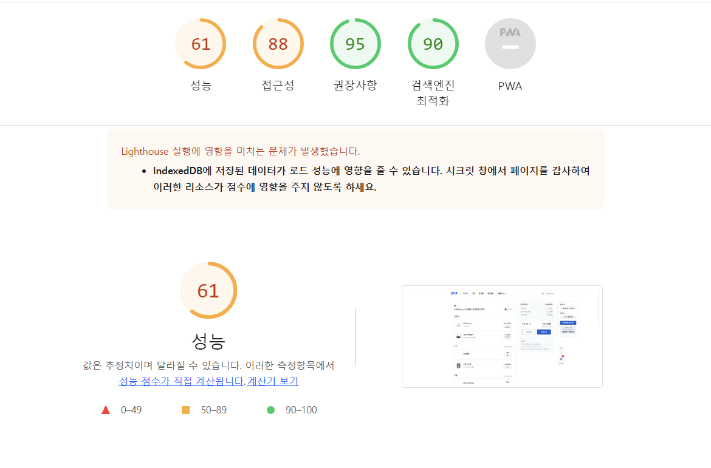

# 2022-12-11 
## 작성자: [@jsw4810](https://github.com/jsw4810)

### Nuxt3를 2023년 하반기부터 접하여 프로젝트에 적용하면서 알아야할 최소 지식 및 최근에 알게된 Lighthouse에 관련 내용을 정리하는 글 
## Nuxt3
- [Nuxt3 Doc](https://nuxt.com/docs/getting-started/introduction) Nuxt3 공식문서
- [SEO](https://nuxt.com/docs/getting-started/seo-meta)
  - Vue는 CSR 동작 방식이기 때문에 서버에서 View를 렌더하지 않고 빈 HTML에 그리기 때문에 SEO의 어려움이 있음
  - Nuxt인 경우 SSR 동작 방식이기 때문에 서버에서 html을 그리기 때문에 SEO에 최적화 되어있음
- [SSR vs CSR](https://onlyfor-me-blog.tistory.com/387)
  - SSR은 서버에서 사용자에게 보여줄 페이지를 모두 구성하여 사용자에게 페이지를 보여주는 방식이다
  - CSR은 서버에서 index 라는 html 파일을 클라이언트에 보내주면 html 에는 자바스크립의 링크만 있을뿐 빈 html에 그린다
- [Hybrid Rendering](https://nuxt.com/docs/guide/concepts/rendering)
  - Nuxt3는 Hybrid Rendering을 지원
    1. 브라우저 주소창으로 페이지 요청
    2. 서버에서 요청에 맞는 프리랜더링 html 보냄
    3. 브라우저에서 html 받고 딸려온 자바스크립트로 하이드레이션
    4. 그 다음은 spa로 동작
  - 각 페이지별 랜더링 모드를 지정할 수 있다 
 ```
  export default defineNuxtConfig({
    routeRules: {
    // Homepage pre-rendered at build time
    '/': { prerender: true },
    // Product page generated on-demand, revalidates in background
    '/products/**': { swr: 3600 },
    // Blog post generated on-demand once until next deploy
    '/blog/**': { isr: true },
    // Admin dashboard renders only on client-side
    '/admin/**': { ssr: false },
    // Add cors headers on API routes
    '/api/**': { cors: true },
    // Redirects legacy urls
    '/old-page': { redirect: '/new-page' }
    }
  })
 ```
- [Auto routing](https://nuxt.com/docs/getting-started/routing)
  - Directory을 이용하여 자동으로 라우팅을 해주어 vue에서 작성했던 route.js를 작성할 필요가없다
- [Data fetching ($fetch,useAsyncData,useFetch)](https://jongmin4943.tistory.com/entry/Nuxt3-fetch-useAsyncData-useFetch-%EC%9D%98-%EC%B0%A8%EC%9D%B4)
  - Nuxt3에서 제공하는 전역 메소드이며 해당 메소드를 통해 HTTP 통신을 할 수 있다
  - ofetch라는 라이브러리를 사용하고 있음
  - Node 환경과 Browser 환경 둘다 사용 가능
  - 위의 내용이 Nuxt3가 axios를 채택하지 않는 이유이다
- [Auto Imports](https://nuxt.com/docs/guide/concepts/auto-imports)
  - component, composables등 auto import 기능을 제공함
- 환경변수 (.env) 파일 관련하여 서버사이드와 클라이언트 사이드는 서로 다른것을 바라보게됨
  - mode
    - 서버사이드에서 개발환경에서는 항상 development 이며 bulid 환경에서는 항상 production이다
    - 클라이언트사이드에서는 .env.[mode]에 따라 환경변수 변경이 가능하다

## Lighthouse (브라우저 성능 테스트 도구)
- Lighthouse(라이트하우스)란?
  - 구글에서 개발한, 웹 페이지의 품질을 개선할 수 있는 오픈 소스 형태의 자동화 도구
- 메트릭 종류
  - First Contentful Paint (FCP)
    - 사용자가 특정 웹 페이지로 이동했을 때, 브라우저가 첫 번째 DOM의 콘텐츠를 렌더링하는 데 걸리는 시간
  - Speed Index
    - 웹 페이지를 불러올 때, 콘텐츠가 시각적으로 표시되는 데까지 걸리는 시간
  - Total Blocking Time
    - FCP와 상호작용 시간 사이의 모든 시간의 합으로, 작업 지속 시간이 50ms를 넘으면 밀리초 단위로 표현
  - Largest Contentful Paint (LCP)
    - 최대 텍스트 또는 이미지가 표시되는 시간
  - Cumulative Layout Shift
    - 레이아웃 변경 횟수는 표시 영역 안에 보이는 요소의 이동을 측정
  
  
